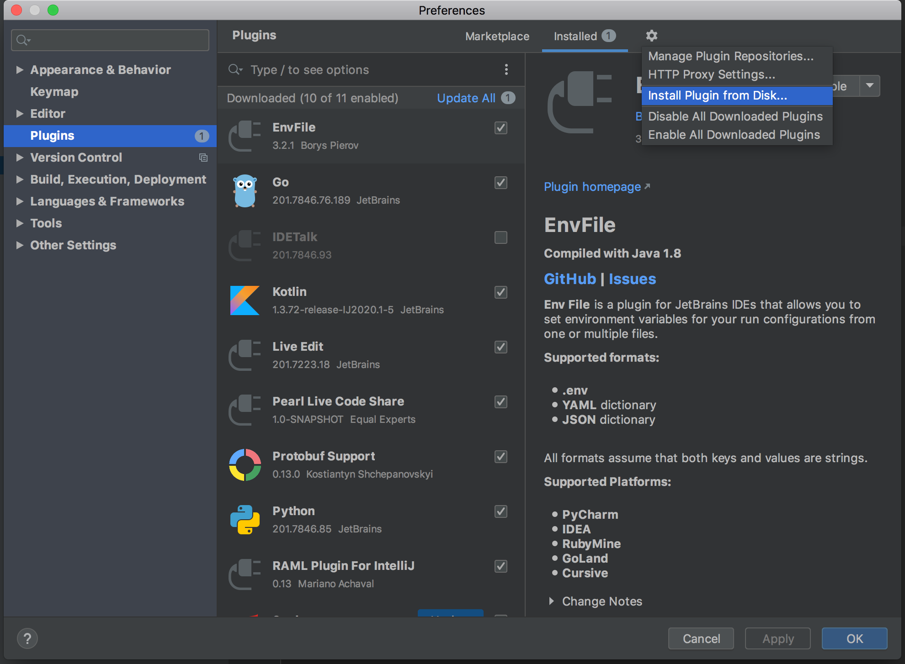

# pearl-live-collaboration

## What is Pearl?
pearl-live-collaboration is an Intellij IDEA plugin to collaborate with team members in a pair/mob programming session. 
It will enable you to start a live code session with your colleagues,
syncs the code in real time among the team members,
thus enabling you to work effortlessly from your own machine your IDE without screen share.
To make your experience easy it will also show you the list of devs on the session and where they are in the code.
This will not only save your bandwidth, but also the time you spend trying to convey your point to the driver. 

How to install pearl-live-collaboration plugin?
**pearl-live-collaboration plugin is compatible with Intellij-IDEA 2020.2**
- Download the plugin jar from [here](https://github.com/eelabs/pearl-live-collaboration/suites/1325283131/artifacts/21169958).
- Go to Intellj IDEA Preferences(MacOS) or Settings(Windows/Linux) -> Plugins
- Click on the gear icon
- Select the downloaded jar file
- Enable the plugin

## How to use pearl-live-collaboration plugin?
To use pearl you would need an XMPP account. You can use any public server (for example: jix.im) or host your own server. 
- Once pearl-live-collaboration plugin installed you should be able to see “Pearl” in the right top bar. 
- When clicked it will ask for your XMPP account details like domain username and password.
- Enter your details and click on “Login”.
- You will now see a collaborator window, meaning you are now in a session and can invite your team mates.
- On the bottom, you can enter the xmpp username of your team and click on ‘+’ to add them to the active session. 
- This will prompt them to accept or deny your invitation. 
- If accepted their username will appear with their associated color (You will be able to view their cursors in the same color)
- All the files are by default in read only mode. To start editing or refactoring the code, right click on any file and select “Take lock” in the context menu.
- To release lock, right click and select “Release lock” from the context menu.
- At any time only one collaborator can take the lock.
- Click on the “End session” to leave the current session.
